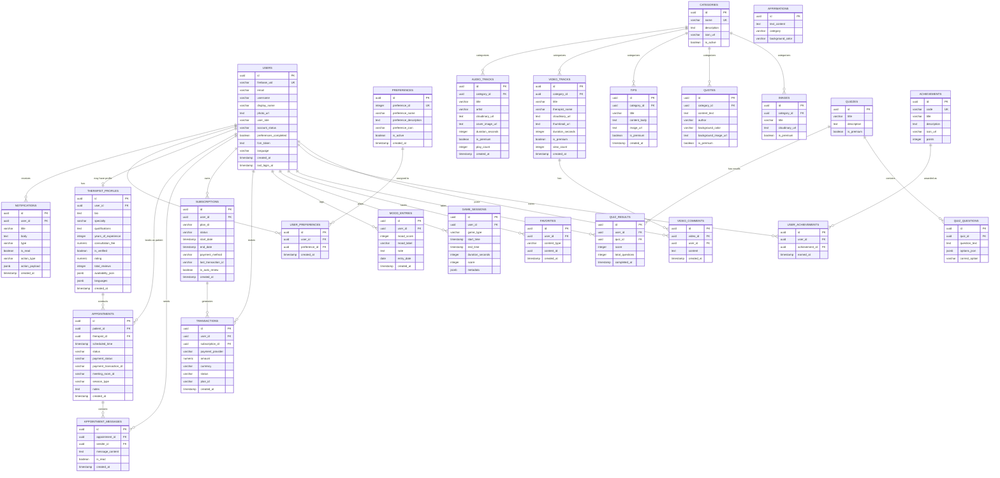

# Entity Relationship Diagram (ERD) - Mermaid Code

```mermaid
erDiagram

    %% -------------------------------------------------------------------------
    %% MERMAID SYNTAX NOTE:
    %% Mermaid's ERD syntax STRICTLY requires both a "type" and a "name" for every column.
    %% If you remove the data type, Mermaid throws an "Expecting ATTRIBUTE_WORD" error.
    %% I have restored the types so the syntax is valid!
    %% -------------------------------------------------------------------------

    USERS {
        uuid id PK
        varchar firebase_uid UK
        varchar email
        varchar username
        varchar display_name
        text photo_url
        varchar user_role
        varchar account_status
        boolean preferences_completed
        text fcm_token
        varchar language
        timestamp created_at
        timestamp last_login_at
    }

    NOTIFICATIONS {
        uuid id PK
        uuid user_id FK
        varchar title
        text body
        varchar type
        boolean is_read
        varchar action_type
        jsonb action_payload
        timestamp created_at
    }

    PREFERENCES {
        uuid id PK
        integer preference_id UK
        varchar preference_name
        text preference_description
        varchar preference_icon
        boolean is_active
        timestamp created_at
    }

    USER_PREFERENCES {
        uuid id PK
        uuid user_id FK
        uuid preference_id FK
        timestamp created_at
    }

    THERAPIST_PROFILES {
        uuid id PK
        uuid user_id FK
        text bio
        varchar specialty
        text qualifications
        integer years_of_experience
        numeric consultation_fee
        boolean is_verified
        numeric rating
        integer total_reviews
        jsonb availability_json
        jsonb languages
        timestamp created_at
    }

    APPOINTMENTS {
        uuid id PK
        uuid patient_id FK
        uuid therapist_id FK
        timestamp scheduled_time
        varchar status
        varchar payment_status
        varchar payment_transaction_id
        varchar meeting_room_id
        varchar session_type
        text notes
        timestamp created_at
    }

    APPOINTMENT_MESSAGES {
        uuid id PK
        uuid appointment_id FK
        uuid sender_id FK
        text message_content
        boolean is_read
        timestamp created_at
    }

    SUBSCRIPTIONS {
        uuid id PK
        uuid user_id FK
        varchar plan_id
        varchar status
        timestamp start_date
        timestamp end_date
        varchar payment_method
        varchar last_transaction_id
        boolean is_auto_renew
        timestamp created_at
    }

    TRANSACTIONS {
        uuid id PK
        uuid user_id FK
        uuid subscription_id FK
        varchar payment_provider
        numeric amount
        varchar currency
        varchar status
        varchar plan_id
        timestamp created_at
    }

    CATEGORIES {
        uuid id PK
        varchar name UK
        text description
        varchar icon_url
        boolean is_active
    }

    AUDIO_TRACKS {
        uuid id PK
        uuid category_id FK
        varchar title
        varchar artist
        text cloudinary_url
        text cover_image_url
        integer duration_seconds
        boolean is_premium
        integer play_count
        timestamp created_at
    }

    VIDEO_TRACKS {
        uuid id PK
        uuid category_id FK
        varchar title
        varchar therapist_name
        text cloudinary_url
        text thumbnail_url
        integer duration_seconds
        boolean is_premium
        integer view_count
        timestamp created_at
    }

    VIDEO_COMMENTS {
        uuid id PK
        uuid video_id FK
        uuid user_id FK
        text content
        timestamp created_at
    }

    TIPS {
        uuid id PK
        uuid category_id FK
        varchar title
        text content_body
        text image_url
        boolean is_premium
        timestamp created_at
    }

    QUOTES {
        uuid id PK
        uuid category_id FK
        text content_text
        varchar author
        varchar background_color
        text background_image_url
        boolean is_premium
    }

    IMAGES {
        uuid id PK
        uuid category_id FK
        varchar title
        text cloudinary_url
        boolean is_premium
    }

    FAVORITES {
        uuid id PK
        uuid user_id FK
        varchar content_type
        uuid content_id
        timestamp created_at
    }

    MOOD_ENTRIES {
        uuid id PK
        uuid user_id FK
        integer mood_score
        varchar mood_label
        text note
        date entry_date
        timestamp created_at
    }

    GAME_SESSIONS {
        uuid id PK
        uuid user_id FK
        varchar game_type
        timestamp start_time
        timestamp end_time
        integer duration_seconds
        integer score
        jsonb metadata
    }

    QUIZZES {
        uuid id PK
        varchar title
        text description
        boolean is_premium
    }

    QUIZ_QUESTIONS {
        uuid id PK
        uuid quiz_id FK
        text question_text
        jsonb options_json
        varchar correct_option
    }

    QUIZ_RESULTS {
        uuid id PK
        uuid user_id FK
        uuid quiz_id FK
        integer score
        integer total_questions
        timestamp completed_at
    }

    AFFIRMATIONS {
        uuid id PK
        text text_content
        varchar category
        varchar background_color
    }

    ACHIEVEMENTS {
        uuid id PK
        varchar code UK
        varchar title
        text description
        varchar icon_url
        integer points
    }

    USER_ACHIEVEMENTS {
        uuid id PK
        uuid user_id FK
        uuid achievement_id FK
        timestamp earned_at
    }

    %% -------------------------------------------------------------------------
    %% RELATIONSHIPS
    %% -------------------------------------------------------------------------

    USERS ||--o{ NOTIFICATIONS : "receives"
    USERS ||--o{ USER_PREFERENCES : "has"
    PREFERENCES ||--o{ USER_PREFERENCES : "assigned to"
    
    USERS ||--o| THERAPIST_PROFILES : "may have profile"
    
    USERS ||--o{ APPOINTMENTS : "books as patient"
    THERAPIST_PROFILES ||--o{ APPOINTMENTS : "conducts"
    
    APPOINTMENTS ||--o{ APPOINTMENT_MESSAGES : "contains"
    USERS ||--o{ APPOINTMENT_MESSAGES : "sends"

    USERS ||--o{ SUBSCRIPTIONS : "owns"
    SUBSCRIPTIONS ||--o{ TRANSACTIONS : "generates"
    USERS ||--o{ TRANSACTIONS : "makes"

    USERS ||--o{ MOOD_ENTRIES : "logs"
    USERS ||--o{ GAME_SESSIONS : "plays"
    USERS ||--o{ FAVORITES : "saves"

    USERS ||--o{ QUIZ_RESULTS : "takes"
    QUIZZES ||--o{ QUIZ_RESULTS : "has results"
    QUIZZES ||--o{ QUIZ_QUESTIONS : "contains"
    
    USERS ||--o{ USER_ACHIEVEMENTS : "earns"
    ACHIEVEMENTS ||--o{ USER_ACHIEVEMENTS : "awarded as"

    CATEGORIES ||--o{ AUDIO_TRACKS : "categorizes"
    CATEGORIES ||--o{ VIDEO_TRACKS : "categorizes"
    CATEGORIES ||--o{ TIPS : "categorizes"
    CATEGORIES ||--o{ QUOTES : "categorizes"
    CATEGORIES ||--o{ IMAGES : "categorizes"

    VIDEO_TRACKS ||--o{ VIDEO_COMMENTS : "has"
    USERS ||--o{ VIDEO_COMMENTS : "posts"

```
