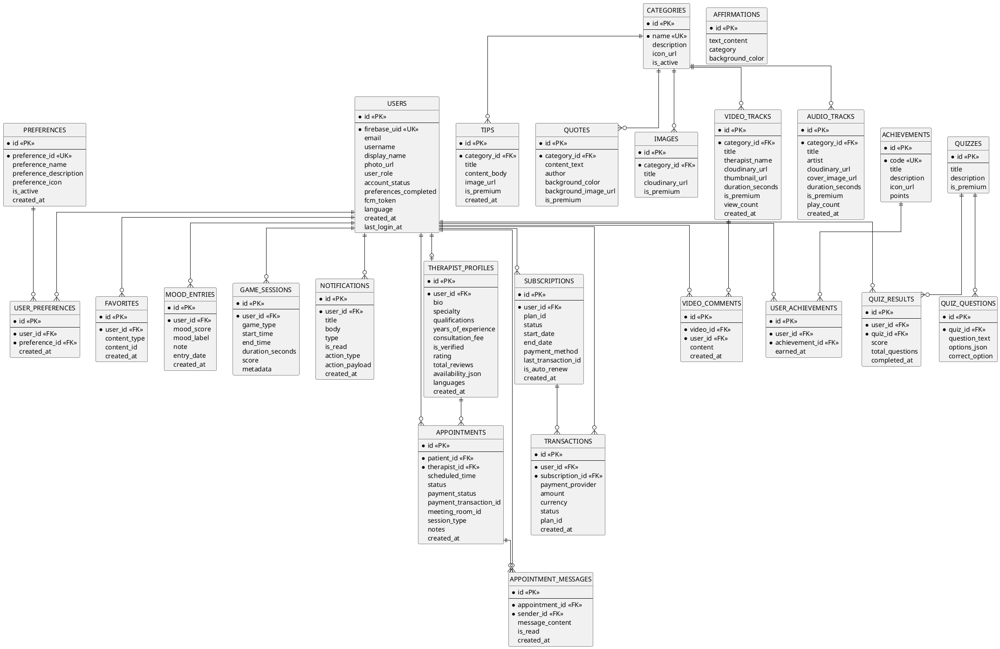

# Entity Relationship Diagram (ERD) - PlantUML Code

```plantuml
@startuml
hide circle
skinparam linetype ortho
skinparam monochrome true
skinparam shadowing false

'-----------------------------------------------------------------------------
' CORE ENTITIES
'-----------------------------------------------------------------------------

entity "USERS" {
  * id <<PK>>
  --
  * firebase_uid <<UK>>
  email
  username
  display_name
  photo_url
  user_role
  account_status
  preferences_completed
  fcm_token
  language
  created_at
  last_login_at
}

entity "NOTIFICATIONS" {
  * id <<PK>>
  --
  * user_id <<FK>>
  title
  body
  type
  is_read
  action_type
  action_payload
  created_at
}

entity "PREFERENCES" {
  * id <<PK>>
  --
  * preference_id <<UK>>
  preference_name
  preference_description
  preference_icon
  is_active
  created_at
}

entity "USER_PREFERENCES" {
  * id <<PK>>
  --
  * user_id <<FK>>
  * preference_id <<FK>>
  created_at
}

'-----------------------------------------------------------------------------
' THERAPY & APPOINTMENTS
'-----------------------------------------------------------------------------

entity "THERAPIST_PROFILES" {
  * id <<PK>>
  --
  * user_id <<FK>>
  bio
  specialty
  qualifications
  years_of_experience
  consultation_fee
  is_verified
  rating
  total_reviews
  availability_json
  languages
  created_at
}

entity "APPOINTMENTS" {
  * id <<PK>>
  --
  * patient_id <<FK>>
  * therapist_id <<FK>>
  scheduled_time
  status
  payment_status
  payment_transaction_id
  meeting_room_id
  session_type
  notes
  created_at
}

entity "APPOINTMENT_MESSAGES" {
  * id <<PK>>
  --
  * appointment_id <<FK>>
  * sender_id <<FK>>
  message_content
  is_read
  created_at
}

'-----------------------------------------------------------------------------
' PAYMENTS & SUBSCRIPTIONS
'-----------------------------------------------------------------------------

entity "SUBSCRIPTIONS" {
  * id <<PK>>
  --
  * user_id <<FK>>
  plan_id
  status
  start_date
  end_date
  payment_method
  last_transaction_id
  is_auto_renew
  created_at
}

entity "TRANSACTIONS" {
  * id <<PK>>
  --
  * user_id <<FK>>
  * subscription_id <<FK>>
  payment_provider
  amount
  currency
  status
  plan_id
  created_at
}

'-----------------------------------------------------------------------------
' CONTENT & MEDIA
'-----------------------------------------------------------------------------

entity "CATEGORIES" {
  * id <<PK>>
  --
  * name <<UK>>
  description
  icon_url
  is_active
}

entity "AUDIO_TRACKS" {
  * id <<PK>>
  --
  * category_id <<FK>>
  title
  artist
  cloudinary_url
  cover_image_url
  duration_seconds
  is_premium
  play_count
  created_at
}

entity "VIDEO_TRACKS" {
  * id <<PK>>
  --
  * category_id <<FK>>
  title
  therapist_name
  cloudinary_url
  thumbnail_url
  duration_seconds
  is_premium
  view_count
  created_at
}

entity "VIDEO_COMMENTS" {
  * id <<PK>>
  --
  * video_id <<FK>>
  * user_id <<FK>>
  content
  created_at
}

entity "TIPS" {
  * id <<PK>>
  --
  * category_id <<FK>>
  title
  content_body
  image_url
  is_premium
  created_at
}

entity "QUOTES" {
  * id <<PK>>
  --
  * category_id <<FK>>
  content_text
  author
  background_color
  background_image_url
  is_premium
}

entity "IMAGES" {
  * id <<PK>>
  --
  * category_id <<FK>>
  title
  cloudinary_url
  is_premium
}

entity "FAVORITES" {
  * id <<PK>>
  --
  * user_id <<FK>>
  content_type
  content_id
  created_at
}

'-----------------------------------------------------------------------------
' TRACKING & GAMIFICATION
'-----------------------------------------------------------------------------

entity "MOOD_ENTRIES" {
  * id <<PK>>
  --
  * user_id <<FK>>
  mood_score
  mood_label
  note
  entry_date
  created_at
}

entity "GAME_SESSIONS" {
  * id <<PK>>
  --
  * user_id <<FK>>
  game_type
  start_time
  end_time
  duration_seconds
  score
  metadata
}

entity "QUIZZES" {
  * id <<PK>>
  --
  title
  description
  is_premium
}

entity "QUIZ_QUESTIONS" {
  * id <<PK>>
  --
  * quiz_id <<FK>>
  question_text
  options_json
  correct_option
}

entity "QUIZ_RESULTS" {
  * id <<PK>>
  --
  * user_id <<FK>>
  * quiz_id <<FK>>
  score
  total_questions
  completed_at
}

entity "AFFIRMATIONS" {
  * id <<PK>>
  --
  text_content
  category
  background_color
}

entity "ACHIEVEMENTS" {
  * id <<PK>>
  --
  * code <<UK>>
  title
  description
  icon_url
  points
}

entity "USER_ACHIEVEMENTS" {
  * id <<PK>>
  --
  * user_id <<FK>>
  * achievement_id <<FK>>
  earned_at
}

'-----------------------------------------------------------------------------
' RELATIONSHIPS
'-----------------------------------------------------------------------------

USERS ||--o{ NOTIFICATIONS
USERS ||--o{ USER_PREFERENCES
PREFERENCES ||--o{ USER_PREFERENCES
USERS ||--o| THERAPIST_PROFILES
USERS ||--o{ APPOINTMENTS
THERAPIST_PROFILES ||--o{ APPOINTMENTS
APPOINTMENTS ||--o{ APPOINTMENT_MESSAGES
USERS ||--o{ APPOINTMENT_MESSAGES
USERS ||--o{ SUBSCRIPTIONS
SUBSCRIPTIONS ||--o{ TRANSACTIONS
USERS ||--o{ TRANSACTIONS
USERS ||--o{ MOOD_ENTRIES
USERS ||--o{ GAME_SESSIONS
USERS ||--o{ FAVORITES
USERS ||--o{ QUIZ_RESULTS
QUIZZES ||--o{ QUIZ_RESULTS
QUIZZES ||--o{ QUIZ_QUESTIONS
USERS ||--o{ USER_ACHIEVEMENTS
ACHIEVEMENTS ||--o{ USER_ACHIEVEMENTS
CATEGORIES ||--o{ AUDIO_TRACKS
CATEGORIES ||--o{ VIDEO_TRACKS
CATEGORIES ||--o{ TIPS
CATEGORIES ||--o{ QUOTES
CATEGORIES ||--o{ IMAGES
VIDEO_TRACKS ||--o{ VIDEO_COMMENTS
USERS ||--o{ VIDEO_COMMENTS

@enduml
```
