# RESILIO — UML DIAGRAMS (Mermaid Code)

## HOW TO USE

Paste any diagram code below into one of these tools:
- **Mermaid Live Editor:** https://mermaid.live (paste and see instantly)
- **draw.io:** Open draw.io > Extras > Edit Diagram > change dropdown to "Mermaid" > paste code
- **VS Code:** Install "Markdown Preview Mermaid Support" extension

---

## DIAGRAM 1: MIND MAP

> **Rendering tip:** Paste into https://mermaid.live — the renderer auto-balances left/right branches to produce the radial layout shown in the reference. Export as SVG or PNG for the report.

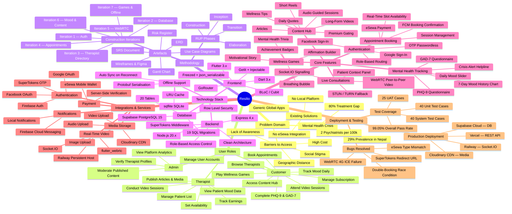
```mermaid
mindmap
  root((Resilio))
    Problem Domain
      Mental Health Crisis
        29% Prevalence in Nepal
        80% Treatment Gap
        2 Psychiatrists per 100k
      Barriers to Access
        Social Stigma
        Geographic Distance
        High Cost
        Lack of Awareness
      Existing Solutions
        No Local Platform
        Generic Global Apps
        No eSewa Integration
    User Roles
      Customer
        Browse Therapists
        Book Appointments
        Attend Video Sessions
        Track Mood Daily
        Complete PHQ-9 & GAD-7
        Play Wellness Games
        Access Content Hub
        Manage Subscription
      Therapist
        Set Availability
        Conduct Video Sessions
        Publish Articles & Media
        View Patient Mood Data
        Track Earnings
        Manage Patient List
      Admin
        Verify Therapist Profiles
        Moderate Published Content
        Manage User Accounts
        View Platform Analytics
    Methodology
      RUP Phases
        Inception
        Elaboration
        Construction
        Transition
      Construction Iterations
        Iteration 1 — Auth
        Iteration 2 — Database
        Iteration 3 — Therapist Directory
        Iteration 4 — Appointments
        Iteration 5 — WebRTC
        Iteration 6 — Mood & Content
        Iteration 7 — Games & Offline
      Artefacts
        SRS Document
        Use Case Diagrams
        ERD
        Wireframes & Figma
        Risk Register
        Gantt Chart
    Technology Stack
      Frontend
        Flutter 3.x
        Dart 3.x
        BLoC / Cubit
        GoRouter
        GetIt + Injectable
        Freezed + json_serializable
      Backend
        Node.js 20.x
        Express 4.x
        Clean Architecture
        SuperTokens Middleware
        Role-Based Access Control
      Database
        Supabase PostgreSQL 15
        Row Level Security
        19 SQL Migrations
        20 Tables
      Offline Support
        sqflite SQLite
        Protobuf Serialisation
        LRU Cache
        Auto Sync on Reconnect
    Core Features
      Authentication
        OTP Passwordless
        Google Sign-In
        Facebook Sign-In
        Role-Based Routing
      Appointment Booking
        Real-Time Slot Availability
        eSewa Payment
        FCM Booking Confirmation
        Session Management
      Live Consultations
        WebRTC Peer-to-Peer Video
        Socket.IO Signalling
        STUN / TURN Fallback
        Patient Context Panel
      Mental Health Tracking
        Daily Mood Slider
        7-Day Mood History Chart
        PHQ-9 Questionnaire
        GAD-7 Questionnaire
        Crisis Alert Helpline
      Content Hub
        Articles
        Audio Guided Sessions
        Long-Form Videos
        Short Reels
        Daily Quotes
        Wellness Tips
        Premium Gating
      Wellness Games
        Breathing Bubble
        Mental Health Trivia
        Affirmation Builder
        Motivational Story
        Achievement Badges
    Integrations & Services
      Authentication
        SuperTokens OTP
        Firebase Auth
        Google OAuth
        Facebook OAuth
      Notifications
        Firebase Cloud Messaging
        Local Notifications
      Media Storage
        Cloudinary CDN
        Image Upload
        Audio Upload
        Video Upload
      Payment
        eSewa Mobile Wallet
        Server-Side Verification
      Real-Time Video
        flutter_webrtc
        Socket.IO
        Railway Persistent Host
    Deployment & Testing
      Production Deployment
        Vercel — REST API
        Railway — Socket.IO
        Supabase Cloud — DB
        Cloudinary CDN — Media
      Test Coverage
        40 Unit Test Cases
        40 System Test Cases
        25 UAT Cases
        99.05% Overall Pass Rate
      Bugs Resolved
        Double-Booking Race Condition
        eSewa Type Mismatch
        WebRTC 4G ICE Failure
        SuperTokens Redirect URL
```

---

## DIAGRAM 2: SYSTEM ARCHITECTURE DIAGRAM

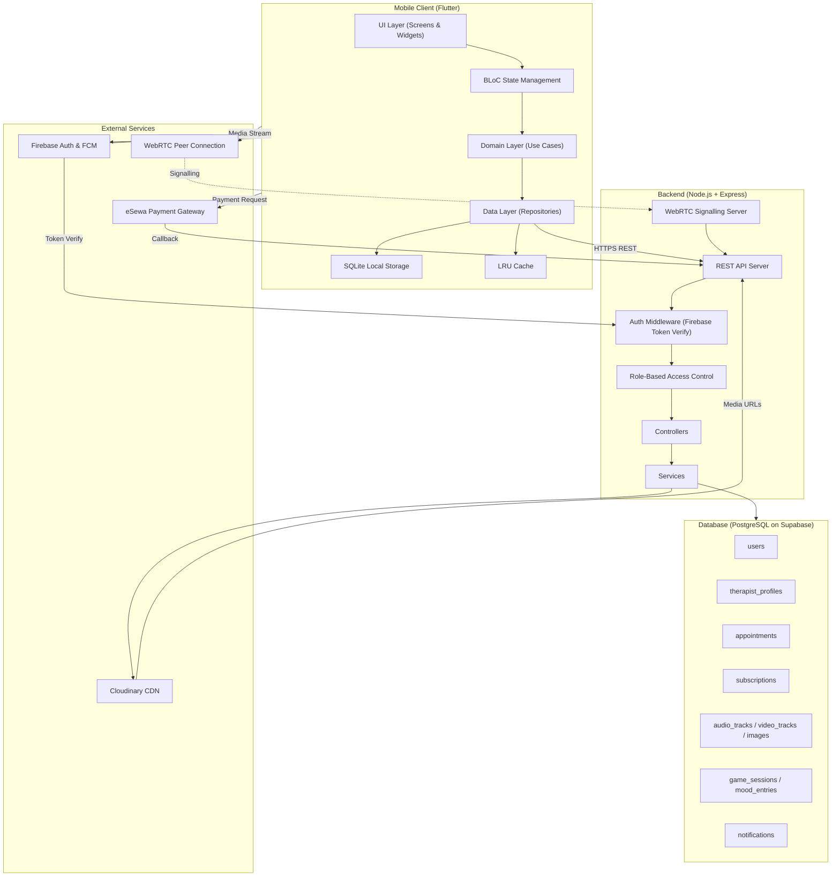
```mermaid
graph TB
    subgraph Client["Mobile Client (Flutter)"]
        UI["UI Layer (Screens & Widgets)"]
        BLOC["BLoC State Management"]
        DOMAIN["Domain Layer (Use Cases)"]
        DATA["Data Layer (Repositories)"]
        SQLITE["SQLite Local Storage"]
        LRU["LRU Cache"]
    end

    subgraph Backend["Backend (Node.js + Express)"]
        API["REST API Server"]
        AUTH_MW["Auth Middleware (Firebase Token Verify)"]
        RBAC["Role-Based Access Control"]
        CONTROLLERS["Controllers"]
        SERVICES["Services"]
        SIGNAL["WebRTC Signalling Server"]
    end

    subgraph Database["Database (PostgreSQL on Supabase)"]
        USERS["users"]
        THERAPISTS["therapist_profiles"]
        APPOINTMENTS["appointments"]
        SUBS["subscriptions"]
        CONTENT["audio_tracks / video_tracks / images"]
        GAMES["game_sessions / mood_entries"]
        NOTIF["notifications"]
    end

    subgraph ExternalServices["External Services"]
        FIREBASE["Firebase Auth & FCM"]
        CLOUDINARY["Cloudinary CDN"]
        ESEWA["eSewa Payment Gateway"]
        WEBRTC["WebRTC Peer Connection"]
    end

    UI --> BLOC
    BLOC --> DOMAIN
    DOMAIN --> DATA
    DATA --> SQLITE
    DATA --> LRU
    DATA -->|"HTTPS REST"| API
    API --> AUTH_MW
    AUTH_MW --> RBAC
    RBAC --> CONTROLLERS
    CONTROLLERS --> SERVICES
    SERVICES --> Database
    SERVICES --> CLOUDINARY
    Client -->|"Firebase Token"| FIREBASE
    FIREBASE -->|"Token Verify"| AUTH_MW
    Client -->|"Payment Request"| ESEWA
    ESEWA -->|"Callback"| API
    Client -->|"Media Stream"| WEBRTC
    WEBRTC -.->|"Signalling"| SIGNAL
    SIGNAL --> API
    CLOUDINARY -->|"Media URLs"| API
    FIREBASE -->|"Push Notifications"| Client
```

---

## DIAGRAM 3: USE CASE DIAGRAM — CUSTOMER

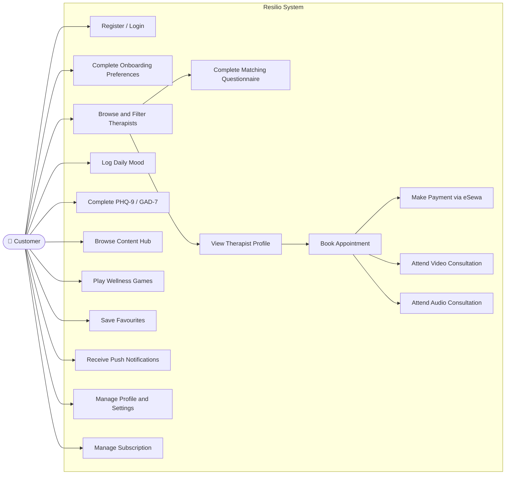
```mermaid
graph LR
    CUSTOMER(["👤 Customer"])

    subgraph Resilio System
        UC1["Register / Login"]
        UC2["Complete Onboarding Preferences"]
        UC3["Browse and Filter Therapists"]
        UC4["Complete Matching Questionnaire"]
        UC5["View Therapist Profile"]
        UC6["Book Appointment"]
        UC7["Make Payment via eSewa"]
        UC8["Attend Video Consultation"]
        UC9["Attend Audio Consultation"]
        UC10["Log Daily Mood"]
        UC11["Complete PHQ-9 / GAD-7"]
        UC12["Browse Content Hub"]
        UC13["Play Wellness Games"]
        UC14["Save Favourites"]
        UC15["Receive Push Notifications"]
        UC16["Manage Profile and Settings"]
        UC17["Manage Subscription"]
    end

    CUSTOMER --> UC1
    CUSTOMER --> UC2
    CUSTOMER --> UC3
    UC3 --> UC4
    UC3 --> UC5
    UC5 --> UC6
    UC6 --> UC7
    UC6 --> UC8
    UC6 --> UC9
    CUSTOMER --> UC10
    CUSTOMER --> UC11
    CUSTOMER --> UC12
    CUSTOMER --> UC13
    CUSTOMER --> UC14
    CUSTOMER --> UC15
    CUSTOMER --> UC16
    CUSTOMER --> UC17
```

---

## DIAGRAM 4: USE CASE DIAGRAM — THERAPIST

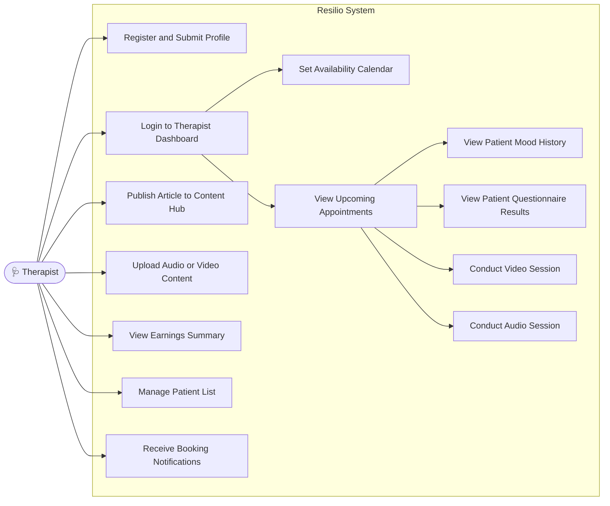
```mermaid
graph LR
    THERAPIST(["🩺 Therapist"])

    subgraph Resilio System
        UT1["Register and Submit Profile"]
        UT2["Login to Therapist Dashboard"]
        UT3["Set Availability Calendar"]
        UT4["View Upcoming Appointments"]
        UT5["View Patient Mood History"]
        UT6["View Patient Questionnaire Results"]
        UT7["Conduct Video Session"]
        UT8["Conduct Audio Session"]
        UT9["Publish Article to Content Hub"]
        UT10["Upload Audio or Video Content"]
        UT11["View Earnings Summary"]
        UT12["Manage Patient List"]
        UT13["Receive Booking Notifications"]
    end

    THERAPIST --> UT1
    THERAPIST --> UT2
    UT2 --> UT3
    UT2 --> UT4
    UT4 --> UT5
    UT4 --> UT6
    UT4 --> UT7
    UT4 --> UT8
    THERAPIST --> UT9
    THERAPIST --> UT10
    THERAPIST --> UT11
    THERAPIST --> UT12
    THERAPIST --> UT13
```

---

## DIAGRAM 5: USE CASE DIAGRAM — ADMIN

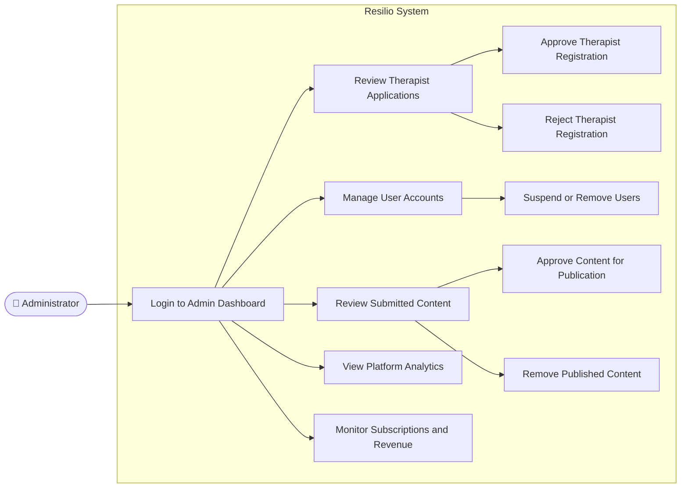
```mermaid
graph LR
    ADMIN(["🔧 Administrator"])

    subgraph Resilio System
        UA1["Login to Admin Dashboard"]
        UA2["Review Therapist Applications"]
        UA3["Approve Therapist Registration"]
        UA4["Reject Therapist Registration"]
        UA5["Manage User Accounts"]
        UA6["Suspend or Remove Users"]
        UA7["Review Submitted Content"]
        UA8["Approve Content for Publication"]
        UA9["Remove Published Content"]
        UA10["View Platform Analytics"]
        UA11["Monitor Subscriptions and Revenue"]
    end

    ADMIN --> UA1
    UA1 --> UA2
    UA2 --> UA3
    UA2 --> UA4
    UA1 --> UA5
    UA5 --> UA6
    UA1 --> UA7
    UA7 --> UA8
    UA7 --> UA9
    UA1 --> UA10
    UA1 --> UA11
```

---

## DIAGRAM 6: ACTIVITY DIAGRAM — APPOINTMENT BOOKING FLOW

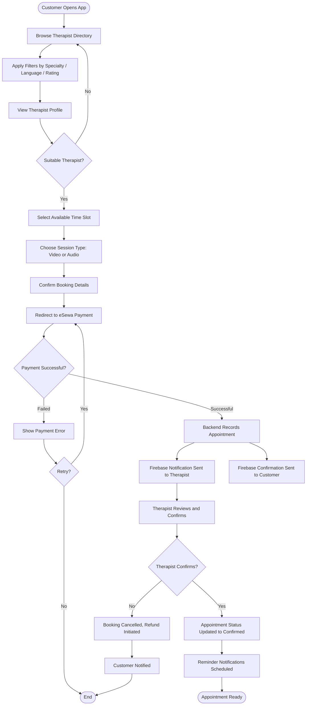
```mermaid
flowchart TD
    A([Customer Opens App]) --> B[Browse Therapist Directory]
    B --> C[Apply Filters by Specialty / Language / Rating]
    C --> D[View Therapist Profile]
    D --> E{Suitable Therapist?}
    E -->|No| B
    E -->|Yes| F[Select Available Time Slot]
    F --> G[Choose Session Type: Video or Audio]
    G --> H[Confirm Booking Details]
    H --> I[Redirect to eSewa Payment]
    I --> J{Payment Successful?}
    J -->|Failed| K[Show Payment Error]
    K --> L{Retry?}
    L -->|Yes| I
    L -->|No| M([End])
    J -->|Successful| N[Backend Records Appointment]
    N --> O[Firebase Notification Sent to Therapist]
    N --> P[Firebase Confirmation Sent to Customer]
    O --> Q[Therapist Reviews and Confirms]
    Q --> R{Therapist Confirms?}
    R -->|No| S[Booking Cancelled, Refund Initiated]
    S --> T[Customer Notified]
    T --> M
    R -->|Yes| U[Appointment Status Updated to Confirmed]
    U --> V[Reminder Notifications Scheduled]
    V --> W([Appointment Ready])
```

---

## DIAGRAM 7: ACTIVITY DIAGRAM — VIDEO CONSULTATION FLOW

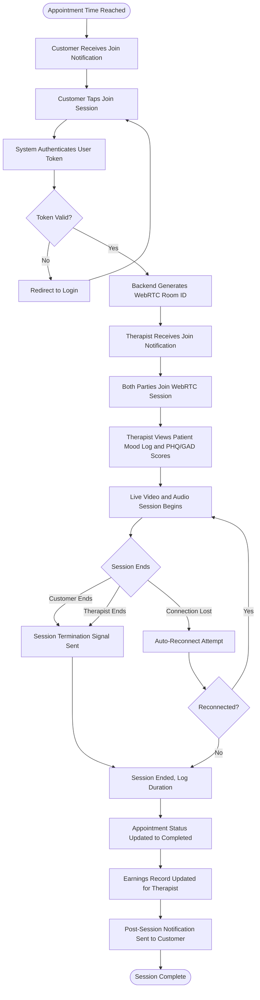
```mermaid
flowchart TD
    A([Appointment Time Reached]) --> B[Customer Receives Join Notification]
    B --> C[Customer Taps Join Session]
    C --> D[System Authenticates User Token]
    D --> E{Token Valid?}
    E -->|No| F[Redirect to Login]
    F --> C
    E -->|Yes| G[Backend Generates WebRTC Room ID]
    G --> H[Therapist Receives Join Notification]
    H --> I[Both Parties Join WebRTC Session]
    I --> J[Therapist Views Patient Mood Log and PHQ/GAD Scores]
    J --> K[Live Video and Audio Session Begins]
    K --> L{Session Ends}
    L -->|Customer Ends| M[Session Termination Signal Sent]
    L -->|Therapist Ends| M
    L -->|Connection Lost| N[Auto-Reconnect Attempt]
    N --> O{Reconnected?}
    O -->|Yes| K
    O -->|No| P[Session Ended, Log Duration]
    M --> P
    P --> Q[Appointment Status Updated to Completed]
    Q --> R[Earnings Record Updated for Therapist]
    R --> S[Post-Session Notification Sent to Customer]
    S --> T([Session Complete])
```

---

## DIAGRAM 8: SEQUENCE DIAGRAM — APPOINTMENT BOOKING

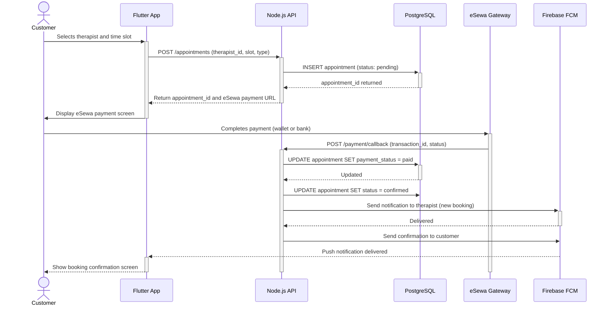
```mermaid
sequenceDiagram
    actor C as Customer
    participant App as Flutter App
    participant API as Node.js API
    participant DB as PostgreSQL
    participant eSewa as eSewa Gateway
    participant FCM as Firebase FCM

    C->>+App: Selects therapist and time slot
    App->>+API: POST /appointments (therapist_id, slot, type)
    API->>+DB: INSERT appointment (status: pending)
    DB-->>-API: appointment_id returned
    API-->>-App: Return appointment_id and eSewa payment URL
    App->>-C: Display eSewa payment screen

    C->>+eSewa: Completes payment (wallet or bank)
    eSewa->>+API: POST /payment/callback (transaction_id, status)
    API->>+DB: UPDATE appointment SET payment_status = paid
    DB-->>-API: Updated
    API->>DB: UPDATE appointment SET status = confirmed
    API->>+FCM: Send notification to therapist (new booking)
    FCM-->>-API: Delivered
    API->>FCM: Send confirmation to customer
    FCM-->>+App: Push notification delivered
    App-->>-C: Show booking confirmation screen
    deactivate eSewa
    deactivate API
```

---

## DIAGRAM 9: SEQUENCE DIAGRAM — WEBRTC VIDEO CONSULTATION

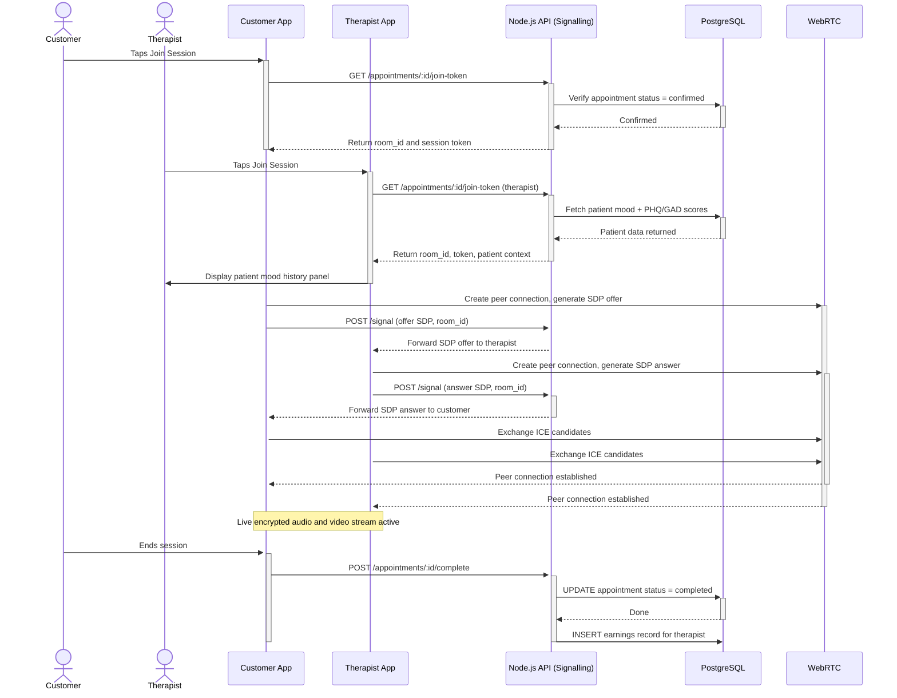
```mermaid
sequenceDiagram
    actor C as Customer
    actor T as Therapist
    participant CApp as Customer App
    participant TApp as Therapist App
    participant API as Node.js API (Signalling)
    participant DB as PostgreSQL
    participant WR as WebRTC

    C->>+CApp: Taps Join Session
    CApp->>+API: GET /appointments/:id/join-token
    API->>+DB: Verify appointment status = confirmed
    DB-->>-API: Confirmed
    API-->>-CApp: Return room_id and session token
    deactivate CApp

    T->>+TApp: Taps Join Session
    TApp->>+API: GET /appointments/:id/join-token (therapist)
    API->>+DB: Fetch patient mood + PHQ/GAD scores
    DB-->>-API: Patient data returned
    API-->>-TApp: Return room_id, token, patient context
    TApp->>-T: Display patient mood history panel

    CApp->>+WR: Create peer connection, generate SDP offer
    CApp->>+API: POST /signal (offer SDP, room_id)
    API-->>+TApp: Forward SDP offer to therapist
    TApp->>+WR: Create peer connection, generate SDP answer
    TApp->>+API: POST /signal (answer SDP, room_id)
    API-->>+CApp: Forward SDP answer to customer
    deactivate API
    CApp->>WR: Exchange ICE candidates
    TApp->>WR: Exchange ICE candidates
    WR-->>-CApp: Peer connection established
    WR-->>-TApp: Peer connection established
    Note over CApp,TApp: Live encrypted audio and video stream active

    C->>+CApp: Ends session
    CApp->>+API: POST /appointments/:id/complete
    API->>+DB: UPDATE appointment status = completed
    DB-->>-API: Done
    API->>DB: INSERT earnings record for therapist
    deactivate API
    deactivate CApp
```

---

## DIAGRAM 10: ENTITY-RELATIONSHIP DIAGRAM

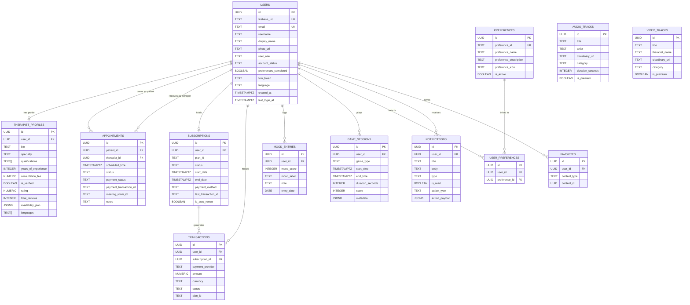
```mermaid
erDiagram
    USERS {
        UUID id PK
        TEXT firebase_uid UK
        TEXT email UK
        TEXT username
        TEXT display_name
        TEXT photo_url
        TEXT user_role
        TEXT account_status
        BOOLEAN preferences_completed
        TEXT fcm_token
        TEXT language
        TIMESTAMPTZ created_at
        TIMESTAMPTZ last_login_at
    }

    THERAPIST_PROFILES {
        UUID id PK
        UUID user_id FK
        TEXT bio
        TEXT specialty
        TEXT[] qualifications
        INTEGER years_of_experience
        NUMERIC consultation_fee
        BOOLEAN is_verified
        NUMERIC rating
        INTEGER total_reviews
        JSONB availability_json
        TEXT[] languages
    }

    APPOINTMENTS {
        UUID id PK
        UUID patient_id FK
        UUID therapist_id FK
        TIMESTAMPTZ scheduled_time
        TEXT status
        TEXT payment_status
        TEXT payment_transaction_id
        TEXT meeting_room_id
        TEXT notes
    }

    SUBSCRIPTIONS {
        UUID id PK
        UUID user_id FK
        TEXT plan_id
        TEXT status
        TIMESTAMPTZ start_date
        TIMESTAMPTZ end_date
        TEXT payment_method
        TEXT last_transaction_id
        BOOLEAN is_auto_renew
    }

    TRANSACTIONS {
        UUID id PK
        UUID user_id FK
        UUID subscription_id FK
        TEXT payment_provider
        NUMERIC amount
        TEXT currency
        TEXT status
        TEXT plan_id
    }

    MOOD_ENTRIES {
        UUID id PK
        UUID user_id FK
        INTEGER mood_score
        TEXT mood_label
        TEXT note
        DATE entry_date
    }

    GAME_SESSIONS {
        UUID id PK
        UUID user_id FK
        TEXT game_type
        TIMESTAMPTZ start_time
        TIMESTAMPTZ end_time
        INTEGER duration_seconds
        INTEGER score
        JSONB metadata
    }

    PREFERENCES {
        UUID id PK
        TEXT preference_id UK
        TEXT preference_name
        TEXT preference_description
        TEXT preference_icon
        BOOLEAN is_active
    }

    USER_PREFERENCES {
        UUID id PK
        UUID user_id FK
        UUID preference_id FK
    }

    NOTIFICATIONS {
        UUID id PK
        UUID user_id FK
        TEXT title
        TEXT body
        TEXT type
        BOOLEAN is_read
        TEXT action_type
        JSONB action_payload
    }

    AUDIO_TRACKS {
        UUID id PK
        TEXT title
        TEXT artist
        TEXT cloudinary_url
        TEXT category
        INTEGER duration_seconds
        BOOLEAN is_premium
    }

    VIDEO_TRACKS {
        UUID id PK
        TEXT title
        TEXT therapist_name
        TEXT cloudinary_url
        TEXT category
        BOOLEAN is_premium
    }

    FAVORITES {
        UUID id PK
        UUID user_id FK
        TEXT content_type
        UUID content_id
    }

    USERS ||--o| THERAPIST_PROFILES : "has profile"
    USERS ||--o{ APPOINTMENTS : "books as patient"
    USERS ||--o{ APPOINTMENTS : "receives as therapist"
    USERS ||--o| SUBSCRIPTIONS : "holds"
    USERS ||--o{ TRANSACTIONS : "makes"
    USERS ||--o{ MOOD_ENTRIES : "logs"
    USERS ||--o{ GAME_SESSIONS : "plays"
    USERS ||--o{ USER_PREFERENCES : "selects"
    USERS ||--o{ NOTIFICATIONS : "receives"
    USERS ||--o{ FAVORITES : "saves"
    SUBSCRIPTIONS ||--o{ TRANSACTIONS : "generates"
    PREFERENCES ||--o{ USER_PREFERENCES : "linked to"
```

---

## DIAGRAM 11: COLLABORATION DIAGRAM (as Sequence)

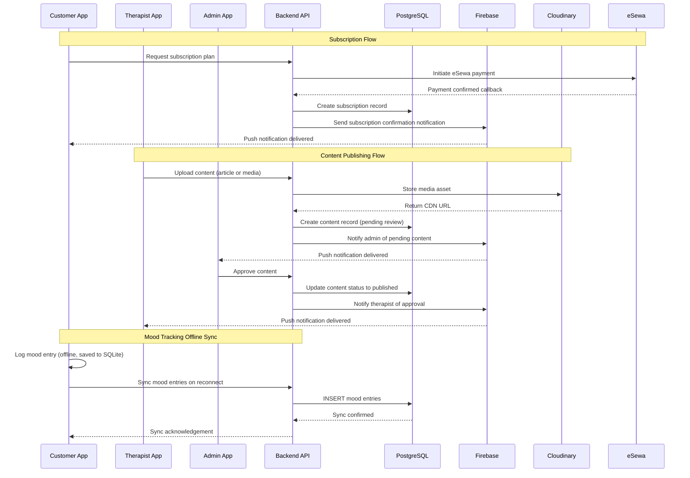
```mermaid
sequenceDiagram
    participant C as Customer App
    participant T as Therapist App
    participant A as Admin App
    participant API as Backend API
    participant DB as PostgreSQL
    participant FB as Firebase
    participant CL as Cloudinary
    participant ES as eSewa

    Note over C,ES: Subscription Flow
    C->>API: Request subscription plan
    API->>ES: Initiate eSewa payment
    ES-->>API: Payment confirmed callback
    API->>DB: Create subscription record
    API->>FB: Send subscription confirmation notification
    FB-->>C: Push notification delivered

    Note over T,CL: Content Publishing Flow
    T->>API: Upload content (article or media)
    API->>CL: Store media asset
    CL-->>API: Return CDN URL
    API->>DB: Create content record (pending review)
    API->>FB: Notify admin of pending content
    FB-->>A: Push notification delivered
    A->>API: Approve content
    API->>DB: Update content status to published
    API->>FB: Notify therapist of approval
    FB-->>T: Push notification delivered

    Note over C,API: Mood Tracking Offline Sync
    C->>C: Log mood entry (offline, saved to SQLite)
    C->>API: Sync mood entries on reconnect
    API->>DB: INSERT mood entries
    DB-->>API: Sync confirmed
    API-->>C: Sync acknowledgement
```

---

## DIAGRAM 12: DATA FLOW DIAGRAM — LEVEL 0 (CONTEXT DIAGRAM)

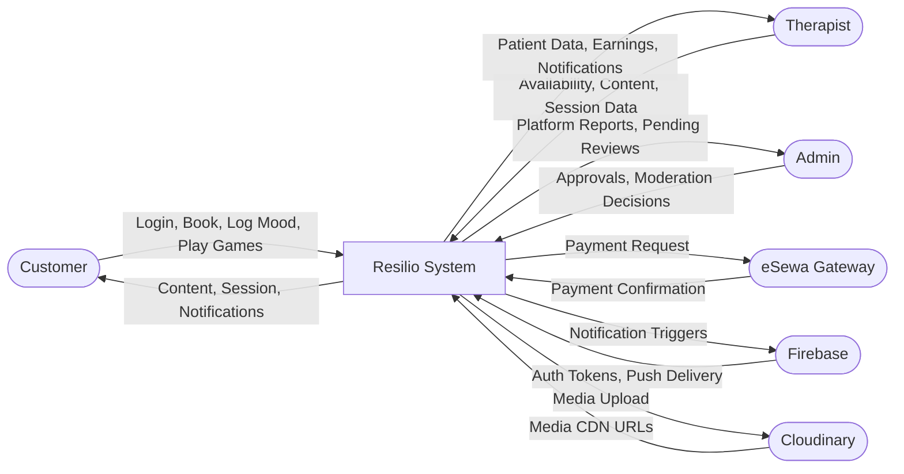
```mermaid
graph LR
    CUSTOMER(["Customer"])
    THERAPIST(["Therapist"])
    ADMIN(["Admin"])
    ESEWA(["eSewa Gateway"])
    FIREBASE(["Firebase"])
    CLOUDINARY(["Cloudinary"])

    SYSTEM["Resilio System"]

    CUSTOMER -->|"Login, Book, Log Mood, Play Games"| SYSTEM
    SYSTEM -->|"Content, Session, Notifications"| CUSTOMER
    THERAPIST -->|"Availability, Content, Session Data"| SYSTEM
    SYSTEM -->|"Patient Data, Earnings, Notifications"| THERAPIST
    ADMIN -->|"Approvals, Moderation Decisions"| SYSTEM
    SYSTEM -->|"Platform Reports, Pending Reviews"| ADMIN
    ESEWA -->|"Payment Confirmation"| SYSTEM
    SYSTEM -->|"Payment Request"| ESEWA
    FIREBASE -->|"Auth Tokens, Push Delivery"| SYSTEM
    SYSTEM -->|"Notification Triggers"| FIREBASE
    CLOUDINARY -->|"Media CDN URLs"| SYSTEM
    SYSTEM -->|"Media Upload"| CLOUDINARY
```

---

## NOTES ON DIAGRAM USAGE

All diagrams above are written in Mermaid syntax version 10+. When pasting into draw.io, use the Mermaid import option under Extras > Edit Diagram and select the Mermaid language option from the dropdown before pasting.

For the ER diagram, draw.io renders the entity boxes and relationship lines correctly. If the layout is crowded, use the auto-layout feature in draw.io after import to redistribute nodes cleanly.

For the sequence diagrams, Mermaid Live Editor at mermaid.live provides the cleanest rendering and allows export to SVG or PNG for inclusion in the final report document.

---

## DIAGRAM 13: CLASS DIAGRAM — FLUTTER DOMAIN MODEL

> **Rendering tip:** Paste into https://mermaid.live. Shows the core domain entities, their attributes, and relationships as implemented in the Flutter clean-architecture layers.


```mermaid
classDiagram
    direction TB

    class User {
        +String id
        +String email
        +String displayName
        +String photoUrl
        +UserRole role
        +AccountStatus status
        +bool preferencesCompleted
        +String? fcmToken
        +DateTime createdAt
    }

    class TherapistProfile {
        +String id
        +String userId
        +String bio
        +String specialty
        +List~String~ qualifications
        +int yearsOfExperience
        +double consultationFee
        +bool isVerified
        +double rating
        +int totalReviews
        +List~String~ languages
        +Map availabilityJson
    }

    class Appointment {
        +String id
        +String patientId
        +String therapistId
        +DateTime scheduledTime
        +AppointmentStatus status
        +PaymentStatus paymentStatus
        +String? paymentTransactionId
        +String? meetingRoomId
        +SessionType sessionType
    }

    class MoodEntry {
        +String id
        +String userId
        +int moodScore
        +String moodLabel
        +String? note
        +DateTime entryDate
    }

    class Subscription {
        +String id
        +String userId
        +String planId
        +SubscriptionStatus status
        +DateTime startDate
        +DateTime endDate
        +bool isAutoRenew
    }

    class ContentItem {
        +String id
        +String title
        +String cloudinaryUrl
        +String category
        +bool isPremium
        +ContentType type
    }

    class AudioTrack {
        +String artist
        +int durationSeconds
    }

    class VideoTrack {
        +String therapistName
    }

    class GameSession {
        +String id
        +String userId
        +GameType gameType
        +DateTime startTime
        +int durationSeconds
        +int score
    }

    class Notification {
        +String id
        +String userId
        +String title
        +String body
        +NotificationType type
        +bool isRead
    }

    class UserPreference {
        +String id
        +String userId
        +String preferenceId
        +String preferenceName
    }

    class Favorite {
        +String id
        +String userId
        +ContentType contentType
        +String contentId
    }

    class AppointmentRepository {
        <<interface>>
        +bookAppointment(Appointment) Future~Appointment~
        +getAppointments(String userId) Future~List~Appointment~~
        +updateStatus(String id, AppointmentStatus) Future~void~
        +joinSession(String id) Future~String~
    }

    class TherapistRepository {
        <<interface>>
        +getTherapists(Map filters) Future~List~TherapistProfile~~
        +getTherapistById(String id) Future~TherapistProfile~
        +submitProfile(TherapistProfile) Future~void~
    }

    User "1" --> "0..1" TherapistProfile : has profile
    User "1" --> "0..*" Appointment : books
    User "1" --> "0..1" Subscription : holds
    User "1" --> "0..*" MoodEntry : logs
    User "1" --> "0..*" GameSession : plays
    User "1" --> "0..*" Notification : receives
    User "1" --> "0..*" UserPreference : selects
    User "1" --> "0..*" Favorite : saves
    ContentItem <|-- AudioTrack : extends
    ContentItem <|-- VideoTrack : extends
    AppointmentRepository ..> Appointment : manages
    TherapistRepository ..> TherapistProfile : manages
```

---

## DIAGRAM 14: STATE MACHINE DIAGRAM — APPOINTMENT LIFECYCLE

> **Rendering tip:** Paste into https://mermaid.live. Shows every possible state an appointment can occupy, with guard conditions on each transition.

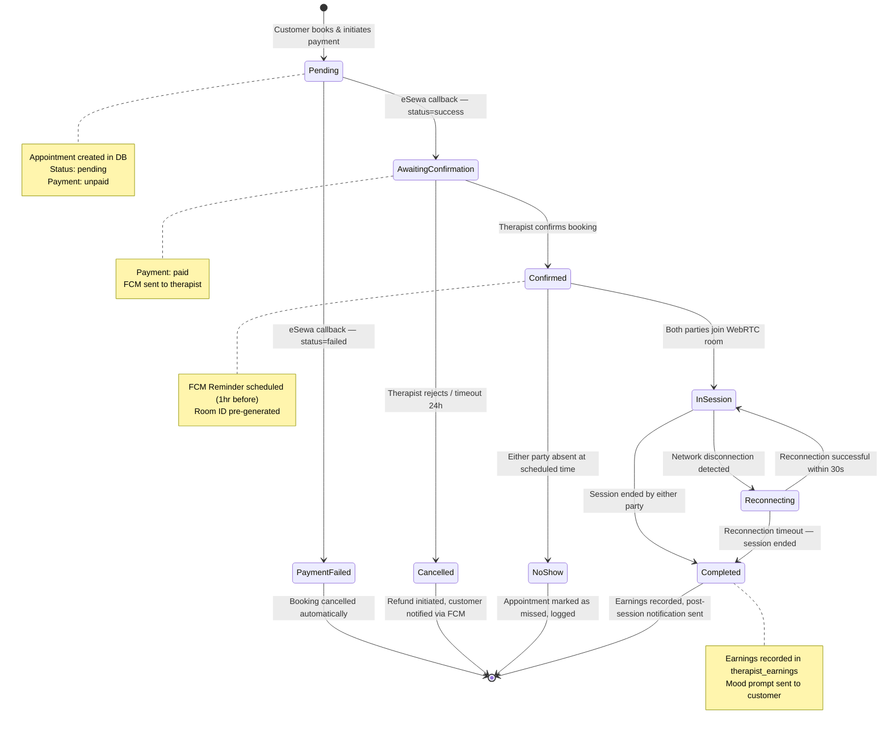
```mermaid
stateDiagram-v2
    [*] --> Pending : Customer books & initiates payment

    Pending --> PaymentFailed : eSewa callback — status=failed
    PaymentFailed --> [*] : Booking cancelled automatically

    Pending --> AwaitingConfirmation : eSewa callback — status=success

    AwaitingConfirmation --> Confirmed : Therapist confirms booking
    AwaitingConfirmation --> Cancelled : Therapist rejects / timeout 24h

    Cancelled --> [*] : Refund initiated, customer notified via FCM

    Confirmed --> InSession : Both parties join WebRTC room
    Confirmed --> NoShow : Either party absent at scheduled time

    NoShow --> [*] : Appointment marked as missed, logged

    InSession --> Completed : Session ended by either party
    InSession --> Reconnecting : Network disconnection detected

    Reconnecting --> InSession : Reconnection successful within 30s
    Reconnecting --> Completed : Reconnection timeout — session ended

    Completed --> [*] : Earnings recorded, post-session notification sent

    note right of Pending
        Appointment created in DB
        Status: pending
        Payment: unpaid
    end note

    note right of AwaitingConfirmation
        Payment: paid
        FCM sent to therapist
    end note

    note right of Confirmed
        FCM Reminder scheduled (1hr before)
        Room ID pre-generated
    end note

    note right of Completed
        Earnings recorded in therapist_earnings
        Mood prompt sent to customer
    end note
```

---

## DIAGRAM 15: DEPLOYMENT DIAGRAM

> **Rendering tip:** Paste into https://mermaid.live. Shows the physical deployment topology — where each system component runs in production.

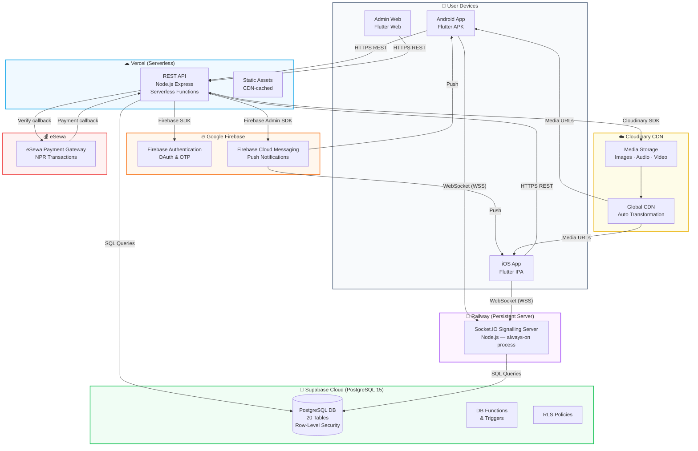
```mermaid
graph TB
    subgraph UserDevices["👤 User Devices"]
        AND["Android App\nFlutter APK"]
        IOS["iOS App\nFlutter IPA"]
        WEB["Admin Web\nFlutter Web"]
    end

    subgraph Vercel["☁ Vercel (Serverless)"]
        direction TB
        RESTAPI["REST API\nNode.js Express\nServerless Functions"]
        STATIC["Static Assets\nCDN-cached"]
    end

    subgraph Railway["🚂 Railway (Persistent Server)"]
        SOCKET["Socket.IO Signalling Server\nNode.js — always-on process"]
    end

    subgraph SupabaseCloud["🐘 Supabase Cloud (PostgreSQL 15)"]
        PG[("PostgreSQL DB\n20 Tables\nRow-Level Security")]
        PGFUNC["DB Functions\n& Triggers"]
        PGRLS["RLS Policies"]
    end

    subgraph Firebase["🔥 Google Firebase"]
        FAUTH["Firebase Authentication\nOAuth & OTP"]
        FCM["Firebase Cloud Messaging\nPush Notifications"]
    end

    subgraph Cloudinary["☁️ Cloudinary CDN"]
        MEDIA["Media Storage\nImages · Audio · Video"]
        CDN["Global CDN\nAuto Transformation"]
    end

    subgraph eSewa["💰 eSewa"]
        EGW["eSewa Payment Gateway\nNPR Transactions"]
    end

    AND -->|"HTTPS REST"| RESTAPI
    IOS -->|"HTTPS REST"| RESTAPI
    WEB -->|"HTTPS REST"| RESTAPI
    AND -->|"WebSocket (WSS)"| SOCKET
    IOS -->|"WebSocket (WSS)"| SOCKET
    RESTAPI -->|"SQL Queries"| PG
    RESTAPI -->|"Firebase SDK"| FAUTH
    RESTAPI -->|"Firebase Admin SDK"| FCM
    RESTAPI -->|"Cloudinary SDK"| MEDIA
    RESTAPI -->|"Verify callback"| EGW
    SOCKET -->|"SQL Queries"| PG
    FCM -->|"Push"| AND
    FCM -->|"Push"| IOS
    MEDIA --> CDN
    CDN -->|"Media URLs"| AND
    CDN -->|"Media URLs"| IOS
    EGW -->|"Payment callback"| RESTAPI

    style Vercel fill:#f0f9ff,stroke:#0ea5e9,stroke-width:2px
    style Railway fill:#fdf4ff,stroke:#a855f7,stroke-width:2px
    style SupabaseCloud fill:#f0fdf4,stroke:#22c55e,stroke-width:2px
    style Firebase fill:#fff7ed,stroke:#f97316,stroke-width:2px
    style Cloudinary fill:#fefce8,stroke:#eab308,stroke-width:2px
    style eSewa fill:#fef2f2,stroke:#ef4444,stroke-width:2px
    style UserDevices fill:#f8fafc,stroke:#64748b,stroke-width:2px
```

---

## SEQUENCE DIAGRAM 3: OTP AUTHENTICATION FLOW

> Existing SD 1 = Appointment Booking, SD 2 = WebRTC Session. This is SD 3.
> Shows the full passwordless OTP login via SuperTokens, including role-based redirect on success.

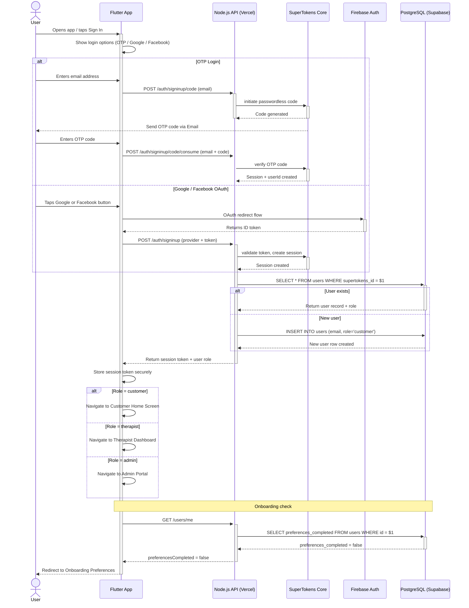
```mermaid
sequenceDiagram
    actor U as User
    participant App as Flutter App
    participant API as Node.js API (Vercel)
    participant ST as SuperTokens Core
    participant FB as Firebase Auth
    participant DB as PostgreSQL (Supabase)

    U->>+App: Opens app / taps Sign In
    App->>App: Show login options (OTP / Google / Facebook)

    alt OTP Login
        U->>App: Enters email address
        App->>+API: POST /auth/signinup/code (email)
        API->>+ST: initiate passwordless code
        ST-->>-API: Code generated
        deactivate API
        ST-->>U: Send OTP code via Email
        U->>App: Enters OTP code
        App->>+API: POST /auth/signinup/code/consume (email + code)
        API->>+ST: verify OTP code
        ST-->>-API: Session + userId created
    else Google / Facebook OAuth
        U->>App: Taps Google or Facebook button
        App->>+FB: OAuth redirect flow
        FB-->>-App: Returns ID token
        App->>+API: POST /auth/signinup (provider + token)
        API->>+ST: validate token, create session
        ST-->>-API: Session created
    end

    API->>+DB: SELECT * FROM users WHERE supertokens_id = $1
    alt User exists
        DB-->>-API: Return user record + role
    else New user
        API->>DB: INSERT INTO users (email, role='customer')
        DB-->>API: New user row created
    end

    API-->>-App: Return session token + user role
    App->>App: Store session token securely

    alt Role = customer
        App->>App: Navigate to Customer Home Screen
    else Role = therapist
        App->>App: Navigate to Therapist Dashboard
    else Role = admin
        App->>App: Navigate to Admin Portal
    end

    Note over App,DB: Onboarding check
    App->>+API: GET /users/me
    API->>+DB: SELECT preferences_completed FROM users WHERE id = $1
    DB-->>-API: preferences_completed = false
    API-->>-App: preferencesCompleted = false
    App-->>-U: Redirect to Onboarding Preferences
```

---

## SEQUENCE DIAGRAM 4: CONTENT UPLOAD & ADMIN APPROVAL FLOW

> SD 4 of 5. Shows how a therapist uploads content (article/audio/video), it gets stored via Cloudinary, and an admin reviews and approves or rejects it before it appears in the content hub.

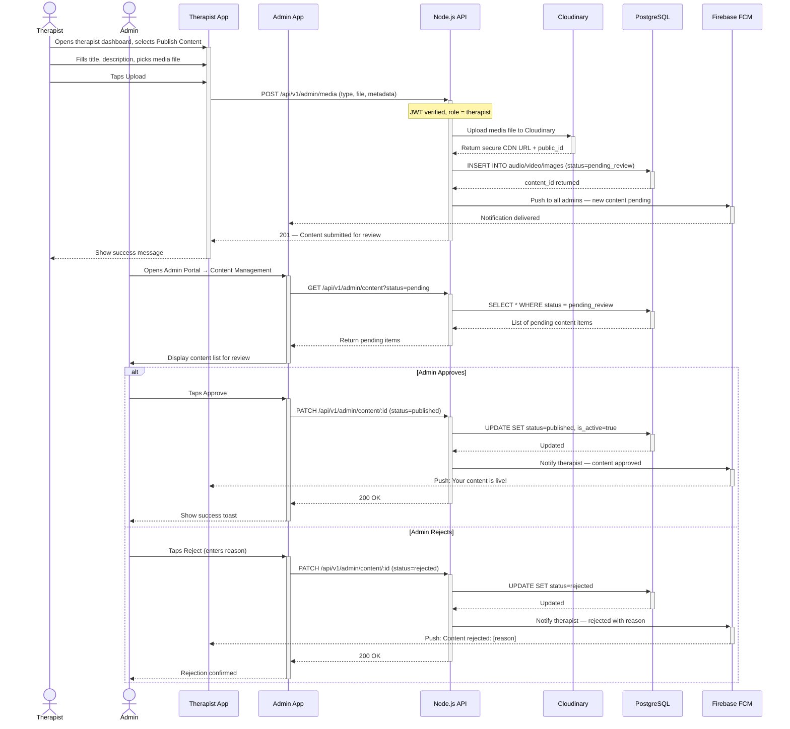
```mermaid
sequenceDiagram
    actor T as Therapist
    actor A as Admin
    participant TApp as Therapist App
    participant AApp as Admin App
    participant API as Node.js API
    participant CL as Cloudinary
    participant DB as PostgreSQL
    participant FCM as Firebase FCM

    T->>+TApp: Opens therapist dashboard, selects Publish Content
    T->>TApp: Fills title, description, picks media file
    T->>TApp: Taps Upload
    TApp->>+API: POST /api/v1/admin/media (type, file, metadata)
    Note over API: JWT verified, role = therapist

    API->>+CL: Upload media file to Cloudinary
    CL-->>-API: Return secure CDN URL + public_id

    API->>+DB: INSERT INTO audio/video/images (status=pending_review)
    DB-->>-API: content_id returned

    API->>+FCM: Push to all admins — new content pending
    FCM-->>-AApp: Notification delivered
    API-->>-TApp: 201 — Content submitted for review
    TApp-->>-T: Show success message

    A->>+AApp: Opens Admin Portal → Content Management
    AApp->>+API: GET /api/v1/admin/content?status=pending
    API->>+DB: SELECT * WHERE status = pending_review
    DB-->>-API: List of pending content items
    API-->>-AApp: Return pending items
    AApp->>-A: Display content list for review

    alt Admin Approves
        A->>+AApp: Taps Approve
        AApp->>+API: PATCH /api/v1/admin/content/:id (status=published)
        API->>+DB: UPDATE SET status=published, is_active=true
        DB-->>-API: Updated
        API->>+FCM: Notify therapist — content approved
        FCM-->>-TApp: Push: Your content is live!
        API-->>-AApp: 200 OK
        AApp-->>-A: Show success toast
    else Admin Rejects
        A->>+AApp: Taps Reject (enters reason)
        AApp->>+API: PATCH /api/v1/admin/content/:id (status=rejected)
        API->>+DB: UPDATE SET status=rejected
        DB-->>-API: Updated
        API->>+FCM: Notify therapist — rejected with reason
        FCM-->>-TApp: Push: Content rejected: [reason]
        API-->>-AApp: 200 OK
        AApp-->>-A: Rejection confirmed
    end
```

---

## SEQUENCE DIAGRAM 5: SUBSCRIPTION PURCHASE & PREMIUM CONTENT ACCESS

> SD 5 of 5. Shows the full premium subscription purchase via eSewa, server-side verification, and how the app gates premium content after subscription status is confirmed.

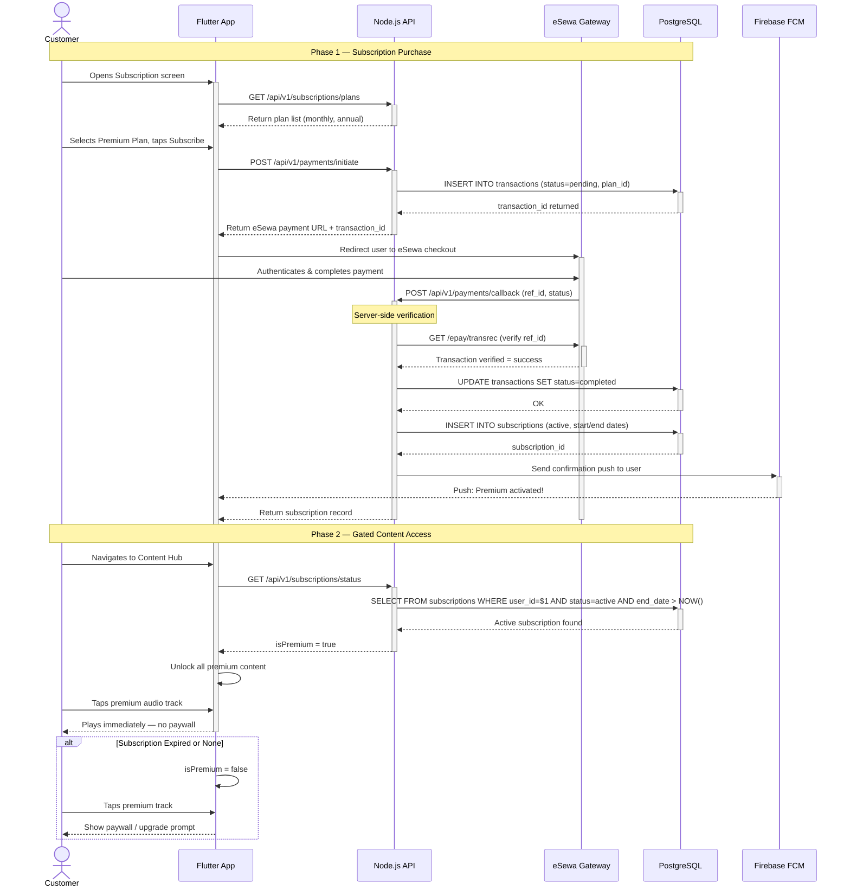
```mermaid
sequenceDiagram
    actor U as Customer
    participant App as Flutter App
    participant API as Node.js API
    participant ES as eSewa Gateway
    participant DB as PostgreSQL
    participant FCM as Firebase FCM

    Note over U,DB: Phase 1 — Subscription Purchase
    U->>+App: Opens Subscription screen
    App->>+API: GET /api/v1/subscriptions/plans
    API-->>-App: Return plan list (monthly, annual)
    U->>App: Selects Premium Plan, taps Subscribe

    App->>+API: POST /api/v1/payments/initiate
    API->>+DB: INSERT INTO transactions (status=pending, plan_id)
    DB-->>-API: transaction_id returned
    API-->>-App: Return eSewa payment URL + transaction_id

    App->>+ES: Redirect user to eSewa checkout
    U->>ES: Authenticates & completes payment
    ES->>+API: POST /api/v1/payments/callback (ref_id, status)

    Note over API: Server-side verification
    API->>+ES: GET /epay/transrec (verify ref_id)
    ES-->>-API: Transaction verified = success

    API->>+DB: UPDATE transactions SET status=completed
    DB-->>-API: OK
    API->>+DB: INSERT INTO subscriptions (active, start/end dates)
    DB-->>-API: subscription_id
    API->>+FCM: Send confirmation push to user
    FCM-->>-App: Push: Premium activated!
    API-->>-App: Return subscription record
    deactivate ES

    Note over U,DB: Phase 2 — Gated Content Access
    U->>App: Navigates to Content Hub
    App->>+API: GET /api/v1/subscriptions/status
    API->>+DB: SELECT FROM subscriptions WHERE user_id=$1 AND status=active AND end_date > NOW()
    DB-->>-API: Active subscription found
    API-->>-App: isPremium = true
    App->>App: Unlock all premium content
    U->>App: Taps premium audio track
    App-->>-U: Plays immediately — no paywall

    alt Subscription Expired or None
        App->>App: isPremium = false
        U->>App: Taps premium track
        App-->>U: Show paywall / upgrade prompt
    end
```

    Note over API: Server-side verification
    API->>ES: GET /epay/transrec (verify ref_id from eSewa)
    ES-->>API: Transaction status confirmed = success

    API->>DB: UPDATE transactions SET status = 'completed'
    API->>DB: INSERT INTO subscriptions (user_id, plan_id, status=active, start/end dates)
    DB-->>API: subscription_id

    API->>FCM: Send subscription confirmation to user
    FCM-->>App: Push notification: "Premium activated!"
    API-->>App: Return updated subscription record

    Note over U,DB: Phase 2 — Gated Content Access
    App->>App: User navigates to Content Hub
    App->>API: GET /api/v1/audio?page=1
    API->>DB: SELECT * FROM audio_tracks (no filter)
    DB-->>API: All tracks including is_premium=true ones

    App->>API: GET /api/v1/subscriptions/status
    API->>DB: SELECT * FROM subscriptions WHERE user_id=$1 AND status=active AND end_date > NOW()
    DB-->>API: Active subscription found
    API-->>App: isPremium = true

    App->>App: Render all content (premium unlocked)
    U->>App: Taps a premium audio track
    App->>App: Plays directly (no paywall shown)

    alt No Active Subscription
        App->>App: isPremium = false
        U->>App: Taps premium track
        App->>App: Show paywall / upgrade prompt
    end
```

---

## USE CASE DIAGRAM — FULL SYSTEM (with Include, Extend, Generalization)

> **Rendering tip:** Paste into https://mermaid.live
> Uses `<<include>>` for mandatory sub-use-cases, `<<extend>>` for optional/conditional behaviour, and actor generalization (RegisteredUser → Customer, Therapist, Admin).


```mermaid
graph TB
    %% ── ACTORS ──
    GU([Guest User])
    RU([Registered User])
    CU([Customer])
    TH([Therapist])
    AD([Admin])
    ES([eSewa Gateway])
    FB([Firebase FCM])
    CL([Cloudinary])

    %% ── Actor Generalization (Registered User is parent) ──
    RU -.->|generalization| CU
    RU -.->|generalization| TH
    RU -.->|generalization| AD

    subgraph System["Resilio System Boundary"]

        %% ── Guest Use Cases ──
        UC_REG["Register Account"]
        UC_LOGIN["Login / Authenticate"]

        %% ── Core Auth (shared) ──
        UC_OTP["Verify OTP Code"]
        UC_SESSION["Create User Session"]
        UC_ROLE["Apply Role-Based Routing"]

        %% ── Customer Use Cases ──
        UC_ONBOARD["Complete Onboarding"]
        UC_BROWSE["Browse Therapist Directory"]
        UC_FILTER["Apply Search Filters"]
        UC_PROFILE["View Therapist Profile"]
        UC_BOOK["Book Appointment"]
        UC_PAY["Process eSewa Payment"]
        UC_VERIFY_PAY["Verify Payment Server-Side"]
        UC_JOIN["Join Video Session"]
        UC_SIGNAL["Exchange WebRTC Signals"]
        UC_MOOD["Log Daily Mood"]
        UC_PHQ["Complete PHQ-9 / GAD-7"]
        UC_CONTENT["Browse Content Hub"]
        UC_PREMIUM_CHECK["Check Premium Status"]
        UC_GAMES["Play Wellness Games"]
        UC_FAV["Save Favourites"]
        UC_NOTIF["Receive Push Notifications"]
        UC_MANAGE_PROFILE["Manage Profile & Settings"]
        UC_SUBSCRIBE["Purchase Subscription"]

        %% ── Therapist Use Cases ──
        UC_T_AVAIL["Set Availability Calendar"]
        UC_T_APPTS["View Upcoming Appointments"]
        UC_T_PATIENTS["View Patient List"]
        UC_T_MOOD["View Patient Mood Data"]
        UC_T_PHQ["View PHQ-9 / GAD-7 Results"]
        UC_T_CONTENT["Upload Content / Article"]
        UC_T_MEDIA["Upload Media to Cloudinary"]
        UC_T_SESSION["Conduct Session"]
        UC_T_EARNINGS["View Earnings Summary"]

        %% ── Admin Use Cases ──
        UC_A_VERIFY["Verify Therapist Application"]
        UC_A_APPROVE["Approve / Reject Therapist"]
        UC_A_CONTENT["Review Pending Content"]
        UC_A_PUBCONTENT["Publish / Reject Content"]
        UC_A_USERS["Manage User Accounts"]
        UC_A_SUSPEND["Suspend / Remove User"]
        UC_A_ANALYTICS["View Platform Analytics"]
        UC_A_NOTIFY["Send Notification via FCM"]

    end

    %% ── Guest interactions ──
    GU --> UC_REG
    GU --> UC_LOGIN
    UC_REG -->|"<<include>>"| UC_OTP
    UC_LOGIN -->|"<<include>>"| UC_OTP
    UC_OTP -->|"<<include>>"| UC_SESSION
    UC_SESSION -->|"<<include>>"| UC_ROLE

    %% ── Customer flow ──
    CU --> UC_ONBOARD
    CU --> UC_BROWSE
    UC_BROWSE -->|"<<include>>"| UC_FILTER
    UC_BROWSE -->|"<<include>>"| UC_PROFILE
    CU --> UC_BOOK
    UC_BOOK -->|"<<include>>"| UC_PAY
    UC_PAY -->|"<<include>>"| UC_VERIFY_PAY
    UC_VERIFY_PAY -.->|"<<extend>>"| UC_NOTIF
    CU --> UC_JOIN
    UC_JOIN -->|"<<include>>"| UC_SIGNAL
    CU --> UC_MOOD
    CU --> UC_PHQ
    UC_PHQ -.->|"<<extend>>"| UC_MOOD
    CU --> UC_CONTENT
    UC_CONTENT -->|"<<include>>"| UC_PREMIUM_CHECK
    CU --> UC_GAMES
    CU --> UC_FAV
    CU --> UC_SUBSCRIBE
    UC_SUBSCRIBE -->|"<<include>>"| UC_PAY
    CU --> UC_MANAGE_PROFILE
    CU --> UC_NOTIF

    %% ── Therapist flow ──
    TH --> UC_T_AVAIL
    TH --> UC_T_APPTS
    TH --> UC_T_PATIENTS
    UC_T_PATIENTS -->|"<<include>>"| UC_T_MOOD
    UC_T_PATIENTS -->|"<<include>>"| UC_T_PHQ
    TH --> UC_T_CONTENT
    UC_T_CONTENT -->|"<<include>>"| UC_T_MEDIA
    TH --> UC_T_SESSION
    UC_T_SESSION -->|"<<include>>"| UC_SIGNAL
    TH --> UC_T_EARNINGS
    TH --> UC_NOTIF

    %% ── Admin flow ──
    AD --> UC_A_VERIFY
    UC_A_VERIFY -->|"<<include>>"| UC_A_APPROVE
    UC_A_APPROVE -.->|"<<extend>>"| UC_A_NOTIFY
    AD --> UC_A_CONTENT
    UC_A_CONTENT -->|"<<include>>"| UC_A_PUBCONTENT
    UC_A_PUBCONTENT -.->|"<<extend>>"| UC_A_NOTIFY
    AD --> UC_A_USERS
    UC_A_USERS -.->|"<<extend>>"| UC_A_SUSPEND
    AD --> UC_A_ANALYTICS

    %% ── External Actor interactions ──
    UC_PAY <-->|HTTP callback| ES
    UC_A_NOTIFY -->|triggers| FB
    FB -->|push delivery| UC_NOTIF
    UC_T_MEDIA -->|upload| CL

    %% ── Styling ──
    style GU fill:#f1f5f9,stroke:#94a3b8
    style RU fill:#dbeafe,stroke:#3b82f6
    style CU fill:#d1fae5,stroke:#10b981
    style TH fill:#ede9fe,stroke:#8b5cf6
    style AD fill:#fef3c7,stroke:#f59e0b
    style ES fill:#fee2e2,stroke:#ef4444
    style FB fill:#fff7ed,stroke:#f97316
    style CL fill:#fefce8,stroke:#eab308
```
